# Break & unbreak

## Tiivistelmät

**A01 Broken Access Control**  
- Noin 94 % sovelluksista kärsii jonkinlaisista pääsynhallinnan haavoittuvuuksista
- Yleisimpiä pääsynhallinnan haavoittuvuuksia on liian laajat oikeudet ja URL-osoitteiden muokkaaminen pääsyn ohittamiseksi yms
- Tämän estämiseen pääsynhallinnassa kannattaa käyttää esim. "deny by default"-periaatetta, varmistaa omistajuus tietueisiin sekä pitää pääsynvalvonta ja loki ajan tasalla
    - "deny by default" tarkoittaa, että pääsy estetään automaattisesti kaikilta, jota palomuurikäytäntö ei ole erikseen sallinut
 
**Find Hidden Web Directories - Fuzz URLs with ffuf**
- ffuf on monipuolinen fuzzing-työkalu, joka voi etsiä piilotettuja web-hakemistoja testaamalla useita URL-polkuja automaattisesti
- Näiden tekniikoiden käyttämiseen saattaa joutua hankkimaan sopimuksia ja lupia

**Access control vulnerabilities and privilege escalation**
- Verkkosovellusten pääsynhallinta riippuu autentikoinnista (todennuksesta) ja istunnonhallinnasta
    - **Autentikointi** - kuka käyttäjä on
    - **Istunnonhallinta** - mikä pyyntö kuuluu kenellekin käyttäjälle
    - **Kulunvalvonta** - saako käyttäjä suorittaa toiminnon, jota tämä yrittää suorittaa
- **Pystysuuntainen pääsynhallinta** rajoittaa eri käyttäjätyypeille eri toiminnot (esim. admin voi poistaa käyttäjiä, mutta tavallinen käyttäjä ei)
- **Vaakasuuntainen pääsynhallinta** rajoittaa käyttäjiä näkemään vain omat resurssinsa (esim. pankkitilin tapahtumat)
- **Kontekstisidonnainen pääsynhallinta** estää käyttäjiä tekemästä toimintoja väärässä järjestyksessä (esim. estää ostoskorin muokkauksen maksun jälkeen)

**Raportin kirjoittaminen**
- tekstin tulee olla täsmällinen sekä kertoa mitä on tehty, miten ja mikä on lopputulos
- helppolukuisuus sekä seurattavuus/toistettavuus on tärkeää, lukijan tulee pystyä seuraamaan sekä toistamaan toimenpiteet samalla lopputuloksella
- viittaa käytettyihin lähteisiin, älä plagioi
- raportin sepittäminen vie lukijan aikaa ja on kiellettyä

## Tehtäviä
### Käyttöympäristö

Intel Core i7-1065G7, 3.40 GHz, 4 Core Processor  
RAM: 16 Gt  
Windows 11 Pro, versio 23H2  
Debian 12 Bookworm  

### [010-staff-only](https://terokarvinen.com/hack-n-fix/#010---staff-only)
Aloitin tehtävän tutkimisen 31.10.2024 klo 11 hakemalla päivitykset, lataamalla [Teron sivuilta](https://terokarvinen.com/hack-n-fix/) [tehtäväpaketin](https://terokarvinen.com/hack-n-fix/teros-challenges.zip) sekä purkamalla tiedoston.

    $ sudo apt-get update
    $ wget https://terokarvinen.com/hack-n-fix/teros-challenges.zip
    $ unzip teros-challenges.zip

Avasin `staff-only.py` tiedoston micro-sovelluksella. Latasin tiedoston ohjeistuksella `flask` ja `flask-sqlalchemy` -tiedostot.

    $ sudo apt-get -y install python3-flask
    $ sudo apt-get -y install python3-flask-sqlalchemy
    
Tämän jälkeen siirryin tehtävän kansioon ja avasin tiedoston komennolla:

    $ python3 staff-only.py

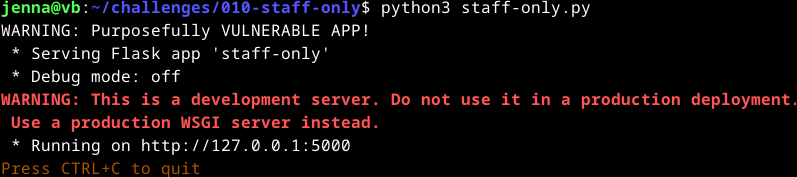

Siirryin selaimella osoitteeseen `127.0.0.1:5000`. 

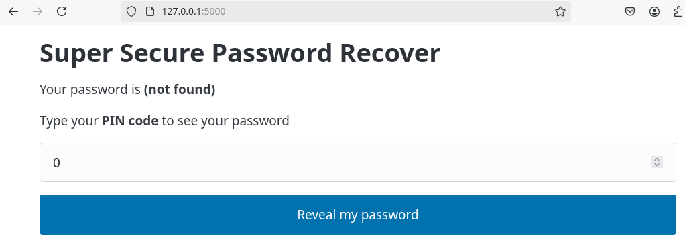

Syötin alkuun annetun pin-koodin `123` ja sain vastaukseksi `Your password is Somedude`.  
Seuraavaksi aloin miettimään, miten saisin admin käyttäjän salasanan auki - ajattelin alkuun, että koodia tulee kirjoittaa tekstikenttään.  
Yiritin tunnilla tehdyn PortSwigger [tehtävän](https://portswigger.net/web-security/sql-injection/lab-retrieve-hidden-data) tyylillä erilaisia syötteitä kuten `' or 1=1--`, `' or 1=1--;` ja `' or 1=1;--`. Huomasin, että tässä vaadittiin pelkästään numeroita, mutta en tiennyt onko sillä väliä SQL injectionissa. Tässä miettimisessä ja testailussa meni todella paljon aikaa.  

Älysin sitten kokeilla `Inspect` -työkalua ja löysin tekstikentän kohdalta `type="number"` ja poistin numberin siitä. Tämän jälkeen tekstikenttään oli mahdollista lisätä kirjaimia. Koitin taas `' or 1=1--` ja sain `Your password is foo`.  
Yritin vielä samasta `Inspect` kohdasta muokata `name="pin"` -> `"password"`, mutta se ei oikein toiminut tai en osannut käyttää oikein.  

Tuntien yrittämisen ja pähkäilemisen jälkeen löysin PortSwiggerin sivuilta [ohjeen](https://portswigger.net/web-security/sql-injection#retrieving-hidden-data), miten piilotettu data saadaan esiin.  
Kävin poistamassa `Inspector` -näkymässä `"number"` pois `type`-kohdasta. Tämän jälkeen kirjoitin tekstikenttään `' or password like '%superadmin%' --`. Sain ruudulle tämän näkymän:

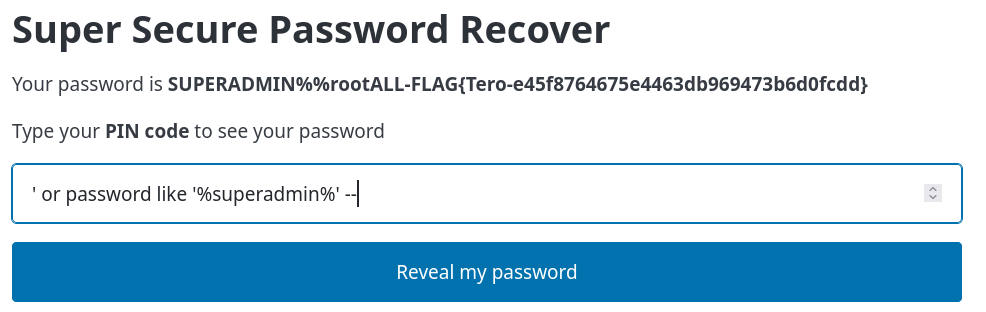

#### Haavoittuvuuden korjaus 

En alkuun tiennyt yhtään, miten saisin lähdekoodin haavoittuvuuden korjattua, mutta palasin vielä tämän pariin sunnuntaina 3.11.2024 klo 15. Sillä perjantaina ystäväni illanistujaisissa keskustelimme aiheesta ja sain upean vinkin, miten helpoiten tälläisen haavoittuvuuden voisi saada korjattua.  
Päätin siis lähteä tutkimaan ja testaamaan tätä tyyliä. Tällä tyyillä poistin vain SELECT lauseesta yhdet hipsut.  

Seuraavaksi testasin tätä syöttämällä tekstikenttään kummatkin `' or 1=1--` ja `' or password like '%superadmin%' --`. Sivu kuitenkin ohjaa `500 Internal Server Error` sivulle, mutta ei anna salasanaa - pidän tätäkin jo voittona.  

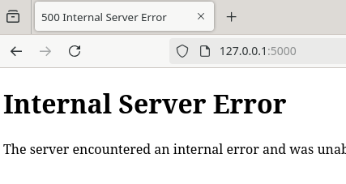

Lopetin tämän korjauksen klo 15:30.

###  [Fuzz URLs with ffuf](https://terokarvinen.com/2023/fuzz-urls-find-hidden-directories/)
Latasin Teron luoman esimerkin ja laitoin sen päälle komennoilla:

    $ wget https://terokarvinen.com/2023/fuzz-urls-find-hidden-directories/dirfuzt-0
    $ chmod u+x dirfuzt-0
    $ ./dirfuzt-0

Avasin selaimesta `http://127.0.0.2:8000`. 

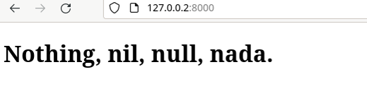

Avasin toisen terminal-ikkunan. Asensin fuff -työkalun ja otin sen käyttöön.

    $ wget https://github.com/ffuf/ffuf/releases/download/v2.0.0/ffuf_2.0.0_linux_amd64.tar.gz
    $ tar -xf ffuf_2.0.0_linux_amd64.tar.gz
    $ ./ffuf

Latasin ohjeista valmiin hakemiston.

    $ wget https://raw.githubusercontent.com/danielmiessler/SecLists/master/Discovery/Web-Content/common.txt

Seuraavaksi katkaisin nettiyhteyden virtuaalikoneelta ja laitoin fuffin käyttöön.

    $ ./ffuf

Syötin seuraavat komennot, jossa ffuf käyttää tekstitiedon sisältämiä sanoja haluttuun kohteeseen (aiemmin avattu).

    $ ./ffuf -w common.txt -u http://127.0.0.2:8000/FUZZ
    $ ./ffuf -w common.txt -u http://127.0.0.2:8000/.bash_history
    $ ./ffuf -w common.txt -u http://127.0.0.2:8000/.bashrc

Seuraavaksi rajataan hakua. Jokaisen ei halutun vastauksen koko on ollut 132 tavua.

    $ ./ffuf -w common.txt -u http://127.0.0.2:8000/FUZZ -fs 132

Haun avulla tuli esiin `FUZZ: admin` ja `FUZZ: render/https://www.google.com`.

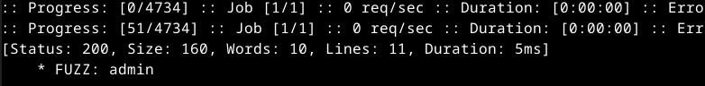

Koitin vielä selaimessa `http://127.0.0.2:8000/admin`.

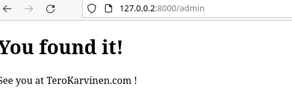

### [020 - Your Eyes Only](https://terokarvinen.com/hack-n-fix/#020---your-eyes-only)
Navigoin itseni tehtävän kansioon ja asensin `virtualenv` ja Python3 paketin:

    $ sudo apt-get -y install virtualenv
    $ virtualenv virtualenv/ -p python3 --system-site-packages

Seuraavaksi aktivoin `virtualenv`:

    $ source virtualenv/bin/activate

Aktivoinnin jälkeen promtiin tuli merkintä `(virtualenv)`.

Tämän jälkeen tarkistin `requirements.txt` ja asensin sen sisällön pip-avulla.

    $ cat requirements.txt
    $ pip install -r requirements.txt

Siirryin kansioon `logtin`, joka sisältää tiedoston `manage.py`. Päivitin tietokannan.  

    $ ./manage.py makemigrations; ./manage.py migrate

Seuraavaksi käynnistin serverin.  

    $ ./manage.py runserver

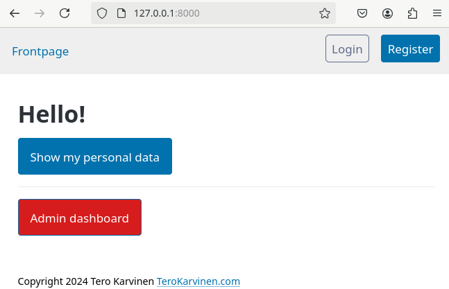

Käynnistin `ffuf`-työkalun.

    $ ./ffuf

Koitin käyttää aiemmassa tehtävässä ladattua tiedostoa.  

    $ ./ffuf -w common.txt -u http://127.0.0.1:8000/accounts/login/?next=/my-data/FUZZ

Kaikki vastaukset olivat melkeimpä samanlaisia. Syötin kuitenkin komennon, jolla rajasin hakua koon mukaan.

    $ ./ffuf -w common.txt -u http://127.0.0.1:8000/accounts/login/?next=/my-data/FUZZ -fs 1583

Koitin myös eri filttereillä -> rivimäärä (-fl), sanamäärän (-fw) ja status (-fc), mutta mikään ei tuottanut tulosta.  

Tässä kohtaan pitkän pähkäilyn päätteeksi huomasin/älysin, että URL taisi olla väärä `ffuf` -työkalua käyttäessä. Koitetaan uudestaan syöttää nämä. 

    $ ./ffuf -w common.txt -u http://127.0.0.1:8000/FUZZ

No kappas. Sieltähän tuli yksi vastaus.

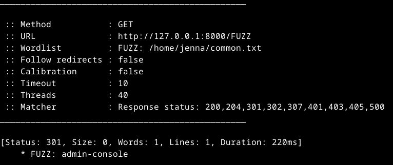

Menin seuraavaksi selaimeen testaamaan tätä, mutta etusivulta suoraan ei sinne pääse. Koitin tätä myös eri kohdista, mutta tuloksetta.  
Päätin koittaa luoda sivulle käyttäjän ja kirjauduin sillä sisään. Sieltähän se löytyi!

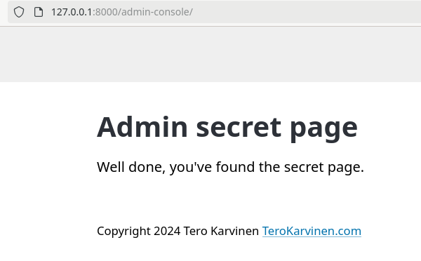

Lopetin tehtävien teon klo 20:10. Hieman taukoja pidin, mutta unohdin ne merkata.

#### Haavoittuvuuden korjaus

Palasin tässäkin kohdassa sunnuntaina 3.11.2024 uudestaan katsomaan näitä korjauksia.  
Avasin tiedoston `views.py` polusta `/logtin/hats` ja tutkin sitä jonkin aikaa. En meinannut ymmärtää mitä siinä pitää korjata ja miten.  
Luin sitten [vinkeistä](https://terokarvinen.com/hack-n-fix/#tips), että korjaus tulisi tehdä `test_func()` sisään. Huomasin tämän jälkeen, että AdminShowAllView luokan testissä ei ole vaadittu käyttäjältä staff-oikeuksia. Lisäsin perään `self.request.user.is_staff` ja sehän toimi!  

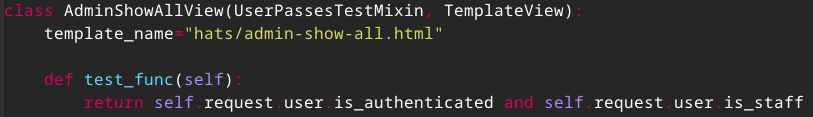  

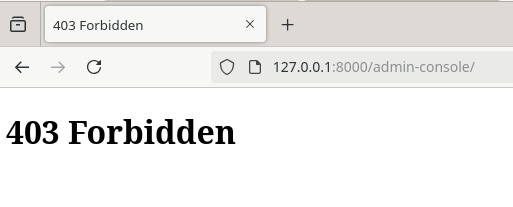

### [PortSwigger labit](https://portswigger.net/web-security/all-labs)

Kummatkin on jo tunnilla tehty. 

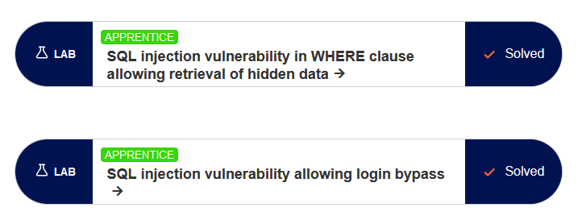

## Lähteet
Karvinen, T. 2024. Tehtävänanto. https://terokarvinen.com/application-hacking/#h2-break--unbreak.  
OWASP. 2021. A01:2021 – Broken Access Control. Luettavissa: https://owasp.org/Top10/A01_2021-Broken_Access_Control/. Luettu: 31.10.2024.  
NIST. s.a. Deny by Default. Luettavissa: https://csrc.nist.gov/glossary/term/deny_by_default. Luettu: 31.10.2024.  
Karvinen, T. 10.5.2023. Find Hidden Web Directories - Fuzz URLs with ffuf. Luettavisa: https://terokarvinen.com/2023/fuzz-urls-find-hidden-directories/. Luettu: 31.10.2024.  
PortSwigger. 2024. Access control vulnerabilities and privilege escalation. Luettavissa: https://portswigger.net/web-security/access-control. Luettu: 31.10.2024.  
Karvinen, T. 4.6.2006. Raportin kirjoittaminen. Luettavissa: https://terokarvinen.com/2006/raportin-kirjoittaminen-4/. Luettu: 31.10.2024.  
Karvinen, T. 30.10.2024. Hack'n Fix. Luettavissa: https://terokarvinen.com/hack-n-fix/. Luettu: 3.11.2024.  
PortSwigger. 2024. SQL injection. Luettavissa: https://portswigger.net/web-security/sql-injection. Luettu: 31.10.2024.  
PortSwigger. 2024. SQL injection cheat sheet. https://portswigger.net/web-security/sql-injection/cheat-sheet. Luettu: 31.10.2024.  
Hackviser. FFUF. FLuettavissa: https://hackviser.com/tactics/tools/ffuf. Luettu: 31.10.2024.
joohoi. 16.5.2020. 0x03 Still Fuzzing Faster (U Fool) - joohoi - HelSec Virtual meetup #1. Video. Katsottavissa: https://www.youtube.com/watch?v=mbmsT3AhwWU. Katsottu: 31.10.2024.

