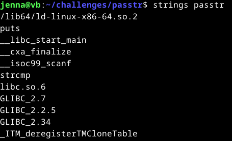
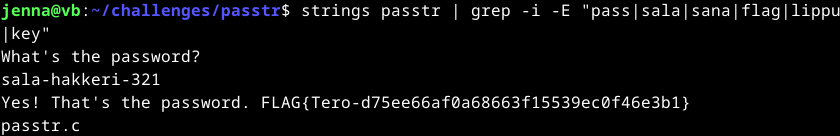
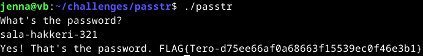
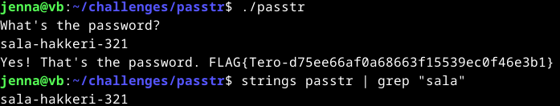
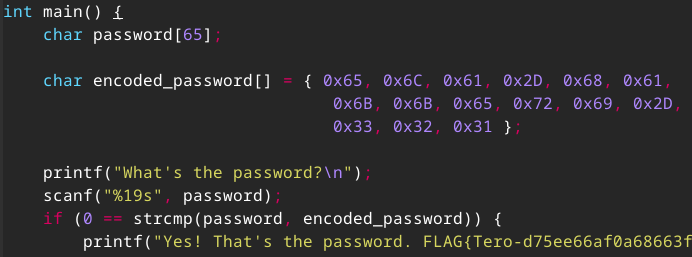
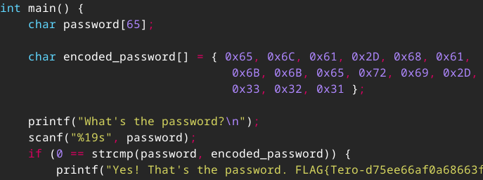
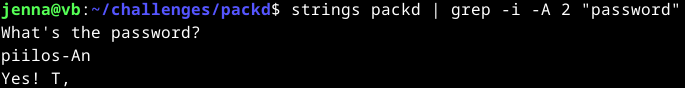
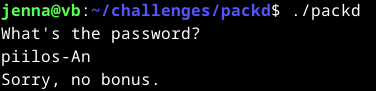

# h3 No strings attached

### Käyttöympäristö

Intel Core i7-1065G7, 3.40 GHz, 4 Core Processor  
RAM: 16 Gt  
Windows 11 Pro, versio 23H2  
Debian 12 Bookworm  

## Tehtäviä

### Strings 
Aloitin 7.11.2024 klo 8 hakemalla päivitykset ja lataamalla tehtävien [ohjeista](https://terokarvinen.com/application-hacking/#h3-no-strings-attached) tehtäväpaketin sekä purkamalla zip-tiedoston.  

    $ sudo apt-get update
    $ wget https://terokarvinen.com/loota/yctjx7/ezbin-challenges.zip
    $ unzip ezbin-challenges.zip

Tämän jälkeen lähtin tutkimaan, mitä `Strings` -työkalu tekee ja miten sitä käytetään. Tämä tieto löytyi todella nopeasti [How-To Geek](https://www.howtogeek.com/427805/how-to-use-the-strings-command-on-linux/) -sivulta.  
`Strings`-työkalu etsii merkkijonoja binääritiedostosta ilman tarvetta tarkastella sen lähdekoodia suoraan.  

Siirryin `passtr`-kansioon, josta `passtr` ja `passtr.c` tiedostot löytyivät. Syötin seuraavan komennon ja ruudulle pitkä lista erilaisia merkkijonoja.  

    $ strings passtr

Lista ei ollut kuitenkaan niin pitkä, että sitä ei voisi silmäillä läpi. Päätin kuitenkin testata tässä vielä `grep`-komentoa.   

Haussa käytin `-i` ja `-E` optioita, jotka muokkaavat tätä:  
-  `-i` tekee hausta case-insensitiven, eli `grep` löytää rivit, joissa hakusanat löytyvät riippumatta siitä onko ne isoilla vai pienillä kirjaimilla.  
- `-E` mahdollistaa monimutkaisempien hakuoperaatioiden käyttämisen. Esimerkiksi tässä käytetty `|` voi etsiä useita hakusanoja yhdellä komennolla.
  
(GeeksforGeeks, 2024)

 Käytin tässä haussa mahdollisimman lyhyitä sanoja tai lyhensin niitä.  

    $ strings passtr | grep -i -E "pass|sala|sana|flag|lippu|key" 

Tulokseksi sain lyhennetyn listan merkkijonona, joista paljastui mahdollinen salasana ja lippu.  

Seuraavaksi mietin, että mitä tässä tehtävässä oikein haluttiin tehdä tuolla salasanalla. Hetkellisen mietinnän jälkeen älysin, että minun tulee asentaa `C`-kieli ja kääntää `passtr`-tiedosto.  
Pääsin taas etsimään ohjeen, että millä nimellä tämä asennetaan ja miten ohjelma käännetään. [Ohje](https://data-flair.training/blogs/install-c-on-linux/) oli Ubuntulle suunnattu, mutta hyvin toimii. Asensin sen komennolla:  

    $ sudo apt-get -y install gcc

Tämän jälkeen käänsin tiedoston komennolla `$ ./passtr`.  
Tämä sitten kysyi salasanaa, mihin laitoin löytämäni `sala-hakkeri-321`.  Sehän se oli!  
Oikean salasanan syöttämällä löytyi myös virallisesti lipun. Minähän sen olin jo innokkaasti etsinyt valmiiksi.  

Tämän tehtävän sain tehtyä klo 9:20.  

### passtr.c korjaus
Aloitin tämän klo 9:55 avaamalla `passtr.c`-tiedoston micro editorilla. Tämän jälkeen lähdin etsimään tietoa, miten C-kielessä salasanan voisi piilottaa.  
Netistä löytyi todella hankalia ohjeita tähän. Itse mietin, että olisiko tässä mahdollista vain encryptaa salasana lähdekoodista selaimen encryptaus-työkalun avulla.  
Lähdin kokeilemaan tätä tyyliä [Base64](https://base64.guru/converter/encode/text) muuntimella sekä [SHA-256](https://emn178.github.io/online-tools/sha256.html) muuntimella. Lisäsin nämä muunnetut salasanat `psstr.c`-tiedostoon.  
Tällä tyylillä salasana toimi `./psstr.c` komennolla, mutta ei läpäissyt `strings psstr | grep "sala"` testiä.

Tässä vaiheessa pyysin [ChatGPT](https://chatgpt.com/):ltä neuvoa, johon tässä sain ohjeistuksen muuttaa salasana heksadesimaaliarvoiksi. Koitin myös tätä, mutta sekään ei estänyt `strings` hakua. 

Tässä kohtaan meni hieman sormi suuhun, kun ei tekoälynkään avulla saa ratkaisua. Pidin tauon.  
Jatkoin aiheen tutkimista vielä taon jälkeen, mutta tuloksetta. Eteeni tuli vain, että kovakoodattuja salasanoja sekä käyttäjätunnuksia ei pystyisi obfuskoimaan.  

Lopetin tämän pähkäilemisen klo 12:40.  

### Packd
Lähdin kokeilemaan tehtävää klo 12:50 avaamalla `packd` kansion ja koitin ajaa `packd` tiedoston komennolla `$./packd`. Siinä pyydettiin taas salasanaa.  
Lähdin kokeilemaan tätä samalla tavalla, kuin `passtr`-kohdassa. 

    $ strings packd | grep -i -E "pass|sala|sana|flag|key"

Se ei paljastanut haluttua salasanaa. Lähdin sitten tutkimaan lisää `grepin` eri hakuoptioita.  
Jos tämä tiedosto menee samalla kaavalla, kuin edellinen, niin silloin salasana olisi noiden kahden rivin välissä.  '

[GeeksforGeeks](https://www.geeksforgeeks.org/grep-command-in-unixlinux/) sivulla olikin näppärä cheat sheet tähän.  
Löysin sieltä sopivan option `-A n`, joka etsii grepin hakusanalla rivin ja tulostaa sen sekä halutun määrän seuraavia rivejä. Lisäsin tähän tulostukseen kaksi ylimääräistä riviä varmistaakseni, että salasanan rivin jälkeen tulee samantyylinen vahvistus/lippurivi kuin aiemmin.  
Muokkasin vielä komentoa ottamalla `-E` pois ja jättämällä hakusanaksi vain tarvittavan `password`.  

    $ strings packd | grep -i -A 2 "password"

Lähdin tämän jälkeen testaamaan tätä salasanaa komennolla `./packd`, mutta sehän ei ole oikein. Harmi.  

Kävin vielä testaamassa `strings` komennolla erilaisia hakuja, mutta mikään ei oikein tuota tulosta.  
Pistin tämänkin tehtävän tauolle. Katsotaan myöhemmin uudestaan.  

## Lähteet
Karvinen, T. 2024. Tehtävänanto. https://terokarvinen.com/application-hacking/#h3-no-strings-attached.  
McKay, D. 9.7.2019. How to Use the strings Command on Linux. How-To Geek. Luettavissa: https://www.howtogeek.com/427805/how-to-use-the-strings-command-on-linux/. Luettu: 7.11.2024.  
GeeksforGeeks. 12.7.2024. grep command in Unix/Linux. Luettavissa: https://www.geeksforgeeks.org/grep-command-in-unixlinux/. Luettu: 7.11.2024.  
Daata Flair. s.a. How to Install C – Learn to Install GCC Compiler for Ubuntu. Luettavissa: https://data-flair.training/blogs/install-c-on-linux/. Luettu: 7.11.2024. 
OpenAI. ChatGPT. Versio 3.5. 2024. https://chat.openai.com/.

