# Kääntöpaikka

## Tiivistelmät
[**GHIDRA for Reverse Engineering (PicoCTF 2022 #42 'bbbloat')**](https://www.youtube.com/watch?v=oTD_ki86c9I)
- Tehtävässä 'Bbbbloat' käänteismallinnetaan annettu binääritiedosto
- Ennakkotyökaluina on käytetty `strace` ja `ltrace` komentoja, jotka tarkastelevat ohjelman kirjastokutsuja
- Ghidran avulla tutkittiin ohjelman pääfunktiota
- Pääfunktiosta löydettiin ehto, joka vertaa syötettyä numeroa heksadesimaaliarvoon
- Heksadesimaali muunnetaan desimaaliin, joka oli ohjelmassa haluttu numero
- Ghidra siis auttaa purkamaan ohjelman logiikan ja sen kautta löytämään halutun lipun

## Tehtäviä
### Käyttöympäristö

Intel Core i7-1065G7, 3.40 GHz, 4 Core Processor  
RAM: 16 Gt  
Windows 11 Pro, versio 23H2  
Debian 12 Bookworm  

### Asenna Ghidra
Kerkesinkin tämän jo asentaa tunnin jälkeen.  
Ohjeissa luki myöhemmin, että tulisi asentaa Ghidran version [Ghidra 11.2.1](https://github.com/NationalSecurityAgency/ghidra/releases/tag/Ghidra_11.2.1_build), mikä toimii Java 17 versiolla. Olen kuitenkin asentanut Ghidran uusimman version ja siihen Java 21 versio.  
Lataan myöhemmin tarvittaessa ohjeistetun vesion, jos tämä ei toimi halutulla tavalla yms. 

###  rever-C
Aloitin tämän tehtävän tutkimisen 14.11.2024 klo 9 kopioimalla `packd` tiedosto.  

    $ cp packd packd-unpackd
  
Tämän jälkeen avasin Ghidra sovelluksen ja loin projektin nimeltä `ghidra`. Tämän jälkeen klikkasin `File` kohdasta `Import File` ja toin `packd-unpackd`-tiedoston.  
Avasin sen tuplaklikkaamalla tiedoston nimeä ja eteeni avautui isompi ruutu, jossa keskellä oli `Listing: packd-unpackd` auki.  

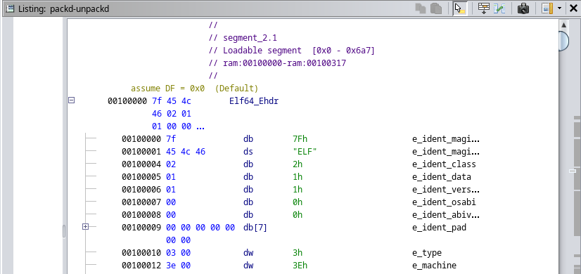

Seuraavaksi etsin sieltä kohdan missä lukee `"What's the password?"`

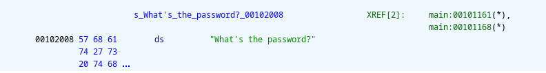

Hammond, J. videossa sekä muistaakseni oppitunnilla tässä kohtaan piti näkyä funktio, mitä minulla ei näkynyt. Koitin kuitenkin tuplaklikkaa `main` kohtaa. Tämä vei funktioiden luo.

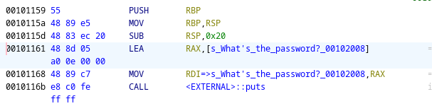

Seuraavaksi klikkasin viereisessä ikkunassa olevaa `Decompile` ruutua. Sieltä tuli näkyviin pääohjelma.

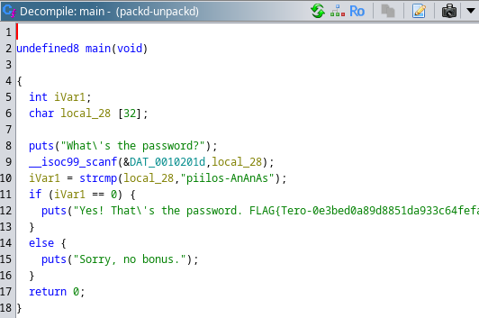

Pääohjelma näyttää tässä suhteellisen selkeältä. Muokkasin muuttujien nimet selkeämmäksi. 

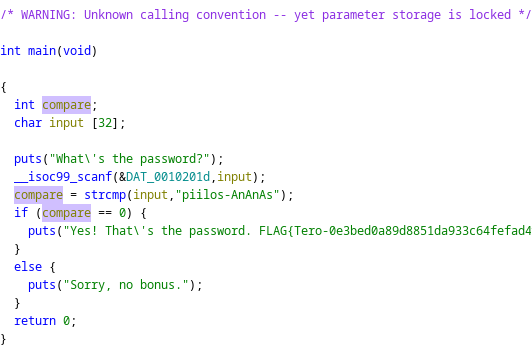

**underfined8** = int  
**iVar** = compare  
**local_28** = input  

**underfined8** muokkaaminen toi kuitenkin varoituksen ruudun yläosaaan.  

**Miten ohjelma toimii?**

1. Käyttäjä syöttää salasanan ohjelmaan
2. Ohjelma vertaa käyttäjän syöttämää salasanaa haluttuun "piilos_AnAnAs" stringiin
3. Jos käyttäjän syöttämä salasana täsmää haluttuun stringiin, vertailun arvoksi tulee 0 ja ohjelma tulostaa hyväksynnän sekä lipun
4. Jos salasana ei täsmää, ohjelma tulostaa "Sorry, no bonus."

Sain tehtävän tehtyä klo 10.

### Jos väärinpäin
Aloitin tehtävän klo 10:20 avaamalla `passtr`-ohjelman binäärin Ghidralla.  
Tiedoston avattua etsin sieltä kohdan, missä salasanaa kysytään - klikkasin sitä. Tämän kautta sain viereiseen ikkunaan taas auki pääohjelman.  
Päätin tässä kohtaa hieman taas selkeyttää sitä ja muokkasin samat muuttujat kuin aiemmassa tehtävässä.  
Tämän jälkeen klikkasin pääohjelmassa `if` kohtaa, mikä ohjasi minut toisella ikkunalla sen käsittelevään kohtaan.  

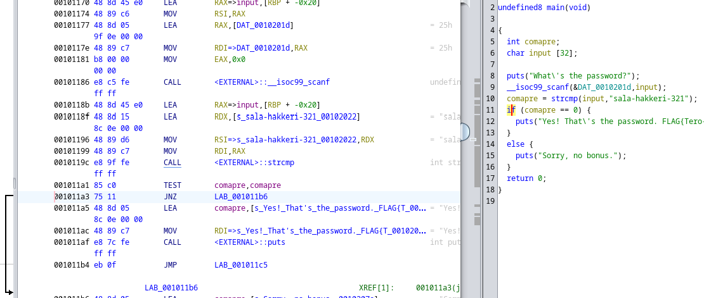

Tätä käytiin tunnilla jo läpi, mutta en ihan muistanut, mitä JNZ tarkoitti. Päädyin etsimään tähän selitystä ja ohjetta, tämän käyttöön. Löysin Woltjer, J [artikkelin](https://jorianwoltjer.com/blog/p/hacking/introduction-to-reverse-engineering-with-ghidra), jossa tämä oltiin selitetty todella hyvin. `JNZ` tarkoittaa "Jump if Not Zero". Jos haluaa, että kaikki salasanat menevät läpi, tulee tämä muuuttaa pelkäksi `JZ` (Jump if Zero).  

Klikkasin `JNZ` kohtaa ja hiiren oikealla klikkauksella valitsin `Patch Instruction` ja muokkasin `JNZ -> JZ`.  
Huomasin samalla, että toisella ikkunalla oleva pääohjelman `if`-lauseke muokkaantui samalla.  

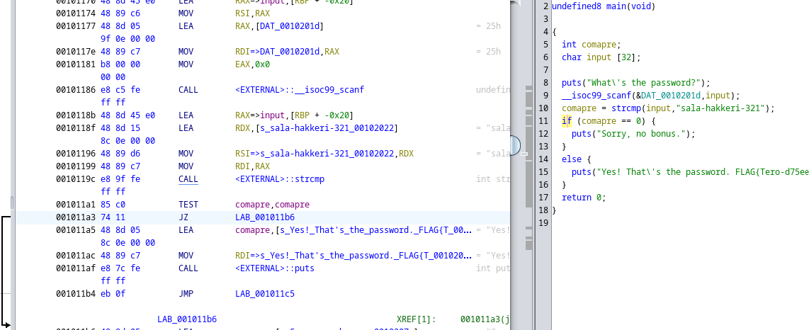

Seuraavaksi oli testaamisen aika.  
Valitsit `File` valikosta kohdan `Export Program`. Vaihdoin `Format -> Original File` ja tarkistin, että se tallennetaan oikeaan kansioon. Tämän jälkeen painoin `OK` ja hyväksyin, että alkuperäinen tiedosto yliajetaan.  
Siirryin `passtr` kansioon ja ajoin ohjelman `./passtr` komennolla. Tämä antoi virheilmoituksen "Permission denied", joten lisäsin tälle tiedostolle käyttö oikeudet.  

    $ chmod +x passtr

Tämän jälkeen ajoin ohjelman uudestaan ja testasin sekä väärää että oikeaa salasanaa.  

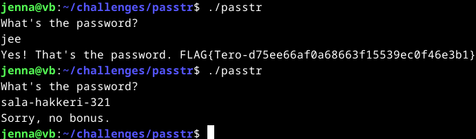

Toimii!
Sain tehtävän tehtyä klo 11:10.  

### Nora CrackMe
Aloitin tehtävän klo 11:15 lataamalla [NoraCodes](https://github.com/NoraCodes/crackmes) githubista tehtäväpaketin, purkamalla sen sekä poistamalla zip paketin.  

    $ wget https://github.com/NoraCodes/crackmes/archive/refs/heads/master.zip
    $ unzip master.zip
    $ rm master.zip

Siirryin tehtäväkansioon ja aloitin tiedostojen kääntämisen binääreiksi. Yritin eka ohjeistuksen mukaan komennolla `$ make crackme01` sain tämän jälkeen tiedoston `crackme01.64` en tiedä oliko se oikein, joten poistin sen. Tämän jälkeen saatoin ehkä vahingossa syöttää pelkän `make` komennon ja tämä kävi jokaisen tiedoston läpi. Ymmärsin, että ehkä tämä `crackme01.64` olikin oikein. No nyt kaikki on ainakin avattu.  

Päädyin tähän lopputulokseen klo 11:30.  

### Nora crackme01
Aloitin tämän ratkaisemisen klo 12:15 testaamalla, miten ohjelma toimii.  
Syötin ekaksi komennon `./crackme01.64` ja sain tulokseksi `Need exactly one argument.`. Seuraavaksi koitin laittaa tekstiä komennon perään ja näinhän se toimi.  

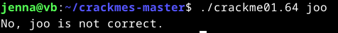

Seuraavaksi lähdin miettimään, miten saan halutun sanan selvitettyä.  
Mietiskelin, että pitääkö tässä suoraan lähteä tutkimaan tiedostoa Ghidran kautta vai ensiksi vain terminalissa. Päädyin kuitenkin testaamaan viime viikolla opetettua `strings` komentoa. 

    $ strings crackme01.64

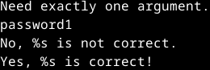

Sieltähän paljastui salasana. Seuraavaksi testasin sen ja se toimi.  

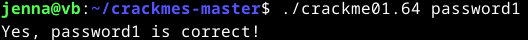

Sain tämän selvitettyä klo 12:30.

### Nora crackme01e
Lähdin selvittelemään tätä koittamalla samaa kuin `crackme01.64` tiedoston kanssa. `strings` komennolla löytyi kohta `slm!paas.k`, mutta sen syöttämällä ohjelmaan ei tuottanut haluttua tulosta.  

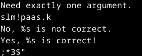
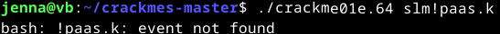

Seuraavaksi avasin tämän tiedoston Ghidralla.  
Avasin ikkunan `Defined Strings` ja etsin sieltä tämän salasanaa muistuttavan rivin. Klikkasin sitä ja avasin ikkunan `Decompile: main`.  Tässä salasanan kohdalla on sama merkkijono. Mietin, että voiko se olla jotenkin salattu, mutta eikö siinä vaiheessa tuossa pitäisi lukea jotain muuta?  

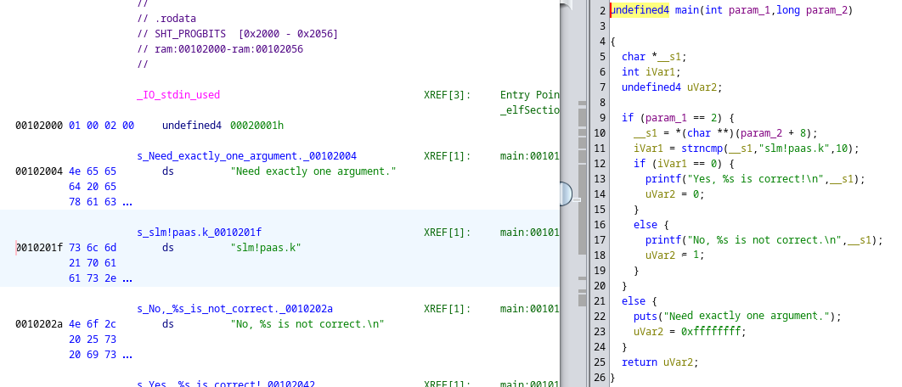

Tässä kohtaan olin pyöritellyt Ghidraa jo tovin aikaa ympäri ja päätin heittää tekoälylle salasanasta `slm!paas.k` saadun vastauksen "bash: !paas.k: event not found". Sieltä tuli selitys, että `!` katkaisee salasanan ja loppua tekstiä luullaan erityiseksi komennoksi (event expansion). Ohjeeksi tuli sivuuttaa tämä erityiskomento laittamalla salasana lainausmerkkien sisään. Lähdin testaamaan tätä ja sehän yllätys, yllätys toimi.  

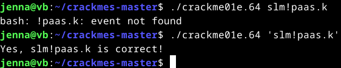

Sain tämän tehtävän ratkaistua klo 13:45.  

### Nora crackme02
Aloitin tehtävän klo 14 tutkimalla `strings` komentoa.

    $ strings crackme02.64

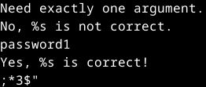

Siellä oli `password1` näkyvillä. Testasin sitä, mutta se ei toiminut ja palasin takaisin tutkimaan `strings` komennon tuotosta.  
Huomasin, että salasana on merkkitty eri kohtaan - näköjään vaikuttaa asiaan.  

Seuraavaksi avasin tiedoston Ghidralla. Etsin `Defined Strings` ikkunassa taas kohdan, missä salasanaa kysytään. Klikkasin sitä ja avasin taas ikkunan `Decompile: main`. Ajan kannsa sain ymmärrettyä muuttujien tarkoitukset ja nimesin ne selkeämmäksi.  

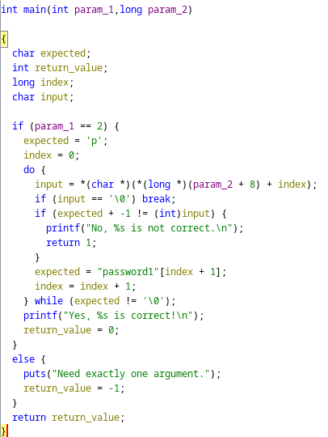

**Miten ohjelma toimii?**   

**1. Alustus:**  
   - `expected` alustaa salasanan ensimmäisen merkin arvolla `p`
   - `index` alustaa sijainnin nollaksi
     
**2. Syöte:**  
   - `input` tallentaa syötteen nykyisen merkin, jos se on `\0` -> silmukka päättyy
     
**3. Parametrin tarkistus:**  
   - `if (param_1 == 2)` tarkistaa, että ohjelmalle on annettu täsmälleen yksi argumentti, jos ei ole -> "Need exactly one argument."
     
**4. Vertailu:**  
   - Silmukka vertaa syötteen merkkiä `input` odotettuun merkkiin `expected`
   - Jos merkit eivät täsmää -> virheilmoitus: "No, ... is not correct." -> ohjelma palauttaa virhekoodin `1`
     
**5. Silmukka:**  
   - Jos merkki täsmää, ohjelma siirtyy seuraavaan odotettuun merkkiin `expected = "password1"[index + 1];`
   - Tämä jatkuu niin kauan kuin kaikki merkit täsmäävät
     
**6. Lopetus:**  
   - Kun salasana on oikein tulostetaan viesti: "Yes, ... is correct!" -> ohjelma palauttaa arvon `0`

Lähdin testaamaan tätä terminalissa. Tämä ei toimi yksittäisillä kirjaimilla tai sanakka `password1`, mutta tyhjän merkin se hyväksyy? Jotenkin tämä ei tarkasta syötteen oikeellisuutta kunnolla ja päästää `''` läpi.  

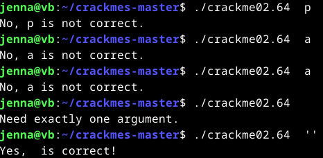

Lopettelin osittain hämmentynein tuntein klo 15:36.  

## Lähteet
Karvinen, T. 2024. Tehtävänanto. https://terokarvinen.com/application-hacking/#h4-kaantopaikka.  
Hammond, J. 27.4.2022. GHIDRA for Reverse Engineering (PicoCTF 2022 #42 'bbbloat'). Video. Katsottavissa: https://www.youtube.com/watch?v=oTD_ki86c9I. Katsottu: 14.11.2024.  
National Security Agency. Ghidra. https://github.com/NationalSecurityAgency/ghidra/releases.  
Leonora Tindall. NoraCodes. crackmes. https://github.com/NoraCodes/crackmes.   
Woltjer. J. 2022. Introduction to Reverse Engineering (with Ghidra). Luettavissa: https://jorianwoltjer.com/blog/p/hacking/introduction-to-reverse-engineering-with-ghidra. Luettu: 14.11.2024.  
OpenAI. ChatGPT. Versio 3.5. 2024. https://chat.openai.com/.  

