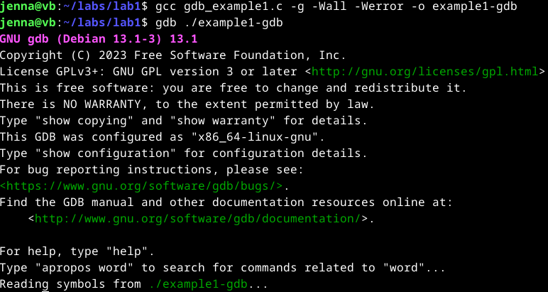

# Se elää!

## Tehtäviä
### Käyttöympäristö

Intel Core i7-1065G7, 3.40 GHz, 4 Core Processor  
RAM: 16 Gt  
Windows 11 Pro, versio 23H2  
Debian 12 Bookworm  

### Lab1
Aloittelin tehtävää siirtymällä `lab1` kansioon. Ajoin siellä olevan tiedoston komennolla `./gdb_example1`. Vastaukseksi sain hieman hämmentävän tekstin.  

Seuraavaksi vielä käänsin koodin ja avasin tiedoston debuggauksen.  

    $ gcc gdb_example1.c -g -Wall -Werror -o example1_gdb
    $ gdb ./example1_gdb

Seuraavaksi syötin komennon `$ l` sekä `$ list`, jotta sain hieman lähdekoodia tutkittua. (`l` on lyhenne `list` komennosta)  

Jaoin ikkunan kahteen osaa, jossa toiseen ikkunaan tulee lähdekoodi ja toiseen assembler-koodi.

    $ layout split

Lisäsin breakpointit molempien funktioiden alkuun ja käynnistin ohjelman.  

    $ break main
    $ break print_scrambled
    $ run

Ohjelman käynnistys siirsi `main` funktion alkuun. Siirryin eteenpäin komennolla `$ step` ja `$ next`.  
Tässä kohtaa en ymmärtänyt ollenkaan mitä tuijottelen. Pidin tauon.  

Tauon jälkeen aloin pyörittelemään ohjelmaa uudestaan debuggerilla, mutta nyt ilman `layout split` näkymää. Yritin saada ymmärrystä tälle.  
Poistin `main` breakpointin ja ajoin tämän uudestaan. Kun `message` oli alustettu, lisäsin sille watchpointin komennolla `$ watch message`.  
Tämän jälkeen syötin komennot `$ next` ja `$ continue`. `next` suorittaa rivin ja `continue` jatoi ohjelmaa seuraavaan breakpointtiin tai watchpointtiin.  
`continue` komennon jälkeen sain ilmoituksen, että watchpoint on saavutettu. Ruudulle ilmestyy `message` vanha ja uusi arvo.  

Syötin komentoa `continue` niin monta kertaa, kunnes merkkijono oli käyty kokonaan läpi. Tämän jälkeen ohjelma tulostaa merkkijonon "Hello, world!" ASCII-arvoissa, joissa kunkin merkin arvo on kasvatettu kolmella (i=3).  

Tässä siis `bad_message = NULL` aiheuttaa virheen, sillä jos tämä `bad_message` olisi arvoltaan `NULL`, silloin `print_scrambled` funktiota ei kutsuta ollenkaan ja ohjelma kaatuu.  Tämän voi korjata tarkistamalla onko `bad_message` tyhjä vai ei. Tein tiedostoon seuraavat muutokset.  

Muutoksien jälkeen käänsin ohjelman uudestaan, jotta muutokset tulevat voimaan myös käännettävään versioon sekä testasin ajamalla tiedoston.  

    $ gcc gdb_example1.c -o gdb_example1
    $ ./gdb_example1

### Lab2
Aloitin suorittamalla ohjelman komennolla `./passtr`. Syötin salasanan aikaisempien viikkojen tehtävistä ja näyttää toimivan normaalisti.  
Tässä samalla huomasin toisen tiedoston `passtr2o`. Ajoin myös tämän ohjelman ja siellä salasana ei toiminukkaan samalla tavalla.  

Älysin pitkän mietiskelyn jälkeen, että tiedosto saadaan auki gdb:llä pelkällä `$ gdb passtr2o` komennolla.  
Seuraavaksi loin breakpointin `main` funktiolle ja ajoin ohjelman `run` komennolla.  Koitin siirtyä eteenpäin `nexti` komennolla, mutta se ei liikkunut mihinkään.  

Avasin tämän jälkeen `layout split` näkymän ja sen kautta heitin muutaman kerran `nexti` komentoa.  
Tutkin tämän jälkeen itse näkyvillä olevaa assemlbly koodia.  
En ymmärtänyt mitä sieltä piti etsiä.  

### Lab3
**Nora crackme03**

Lähdin liikenteeseen ajamalla ohjelman `$ ./crackme03.64` ja tarkistamalla sen lähdekoodia.  
Avasin ohjelman gdb:llä ja asetin heti breakpointit kummallekkin funktiolle `main` ja `check_pw`.  

    $ gdp crackme03.64
    $ break main
    $ break check_pw

Lähdin pyörittelemään ohjelmaa eri tyyleillä `next`, `nexti`, `step`. En löytänyt sieltä oikein mitään. Laitoin myös `layout split` käyttöön, mutta mitään hyödyllistä sen sieltä itse löytänyt.  
Poistelin vuorotellen breakpointteja ja yritin lisätä watchpointteja. Watchpontteja laittaessa herjasi vain `No symbol "" in current context.`. Yiritn katsoa Noran [tutoriaalia](https://nora.codes/tutorial/an-intro-to-x86_64-reverse-engineering/) tähän, mutta en siitäkään ymmärtänyt mitään.  

**Nora crackme04**
Avasin tämän ohjelman suoraan gdp:llä komennolla `gdb crackme04.64`.  
Lähdin tämänkin kanssa etenemään samalla tyylillä kuin edellistäkin tehtävää. En saanut laitettua watchpointtia, enkä ymmärtänyt miksi.  
Katsotaan saanko myöhemmin katsottua näitä paremmin.  
Tällä kertaa tälläisellä menestyksellä.  

## Lähteet
Iso-Anttila, L. 2024. Tehtävänanto. https://terokarvinen.com/application-hacking/#h5-se-elaa.  
Low Level. 17.4.2021. GDB is REALLY easy! Find Bugs in Your Code with Only A Few Commands. Katsottavissa: https://www.youtube.com/watch?v=Dq8l1_-QgAc. Katsottu: 21.11.2024.  
ASCII Table. Luettavissa: https://www.asciitable.com/. Luettu: 21.11.2024.  
NoraCodes. crackmes. An Intro to x86_64 Reverse Engineering. Luettavissa: https://nora.codes/tutorial/an-intro-to-x86_64-reverse-engineering/. Luettu: 21.11.2024.  
OpenAI. ChatGPT. Versio 3.5. 2024. https://chat.openai.com/.  

