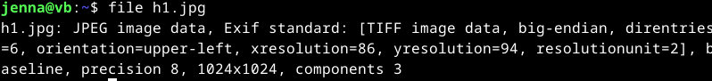

# Sulaa hulluutta

## Tehtäviä
### Käyttöympäristö

Intel Core i7-1065G7, 3.40 GHz, 4 Core Processor  
RAM: 16 Gt  
Windows 11 Pro, versio 23H2  
Debian 12 Bookworm  

### lab0
Aloitin tehävän lataamalla tehtävänannossa linkatun `h1.jpg` kuvan.  

    $ wget https://terokarvinen.com/application-hacking/h1.jpg

Lähdin seuraavaksi tutkimaan sen perustietoja sekä mitä kuvasta saa irti aiemmin opitulla `strings` komennolla.  

    $ file h1.jpg
    $ strings h1.jpg

`strings` komento toikin todella monta rivä erilaista tekstiä. Koitin seuraavaksi hieman rajata hakua.  

    $ strings h1.jpg | less
    

Tuloksen pitkät merkkijonot herättivät hieman hämmennystä, että voiko niissä olla jotain erityistä?  

Tarkistin vielä lopuksi, ettei sitä ole sattumoisinkaan onnistuttu pakkaamaan `upx`.  

    $ upx -d h1.jpg

No ei tietenkään ollut :)

### lab1
Aloitin tämän tehtävän asentamalla binwalkin ja tutkin kuvaa tämän kanssa.  

    $ sudo apt-get -y install binwalk
    $ binwalk h1.jpg

Komennon avulla selvisi, että `h1.jpg` sisältää upotettua dataa - erilaisia zip-arkistoja.  
Toiseksi viimeisellä rivillä näkyy `JPEG image data`, voiko kuvaan olla kätketty toinen kuva?  

Tässä vaiheessa en oikein tiennyt, mitä seuraavaksi tulisi lähteä tutkimaan. Löysin [artikkelin](https://fr3ak-hacks.medium.com/analysing-and-extracting-firmware-using-binwalk-982012281ff6), jossa tiedostoa analysoidaan ja puretaan `binwalkin` avulla.  

Syötin ensiksi komennon `binwalk -y h1.jpg`, jonka pitäisi suorittaa jonkinlaisen skannauksen? Seuraavaksi syötin komennon `$ binwalk -E h1.jpg`, jotta voisin vielä tarkistella tiedoston entropy-analyysia. 

En ihan hirveästi ymmärrä tätä analyysia, mutta ainakin suuret muutokset tarkoittavat jotain erilaista toimintaa tiedoston sisällä. Suurilla muutoksilla tässä tarkoitan sitä, että osa analyysistä tekee suurta liikettä ja osa on pakkautunut ruudun yläosaan. Voiko tuossa kohtaa tieto olla pakattua sekä salattua?  
Seuraavaksi päätin purkaa tiedostot komennolla `$ binwalk -e h1.jpg`.  

Komento antoi samanlaisen näkymän, kuin `$ binwalk h1.jpg` ja hämmennyin hieman. Huomasin sitten, että tämä loi uuden hakemiston näille tiedostoille. 

Koitin avata `494F5.zip` tiedoston, mutta en siinä onnistunut. Syötin seuraavaksi `$ hexdump -C 494F5.zip | less` sekä saman ilman `less`.  
Tämä avasin tiedoston Hex-editorilla ja tarkistin [netistä](https://stackoverflow.com/questions/1887041/what-is-a-good-way-to-test-a-file-to-see-if-its-a-zip-file), miten zip-tiedosto tunnistetaan. Sen alku- ja loppupäässä tulisi olla `50 4B 03 04`, mutta tästä tiedostosta puuttui tämä lopusta.  

Tässä kohtaan tukeuduin ChatGPT:n puoleen ja sain sieltä vinkin koitaa purkaa tiedosto `$ 7z x 494F5.zip` komennolla.  
Tämän kautta kuitenkin tuli ilmoitus, että vain pieni osa dataa on tunnistettua arkistodataa.  
Tämä ei tehnyt mitään? Ainakaan mitään näkyvää.  

Päädyin vielä koittaa eristää ylimääräinen data ja tutkia sitä.  

    $ dd if=494F5.zip of=extra_data bs=1 skip=18822
    $ binwalk extra_data
    $ strings extra_data

Tämä ei tuottanut tulosta, sillä `binwalk` antoi vain `h1.jpg` kuvan tiedot.  

Kävin vielä `_h1.jpg.extracted` hakemiston muut hakemistot läpi, mutta niistä en löytänyt mitään mielenkiintoista.  

### lab2

Valitsin [listasta](https://github.com/offa/android-foss) jonkinlaisen palikka-pelin sovelluksen [Falling Blocks](https://github.com/Sajeg/falling-blocks).  
Latasin tehtävään tarvittavat työkalut.  

#### ZIP

Purin tiedoston `unzip` komennolla.  

    $ unzip Falling_Blocks_Android_v1.8.2.apk

Tämä toi uusia hakemistoja, missä kaikki tarvittavat tiedostot ovat.  
Päätin avata tiedoston `AndroidManifest.xml`. Siitä ei saanut mitään selvää, sillä teksti on salattua.  

#### JADX
Avasin työkalun `jadx-gui` komennolla `./jadx-gui`. Tämä avaa työkalun graafisen käyttöliittymän.  
Sovelluksessa avasin tiedoston `Falling_Blocks_Android_v1.8.2.apk`. 

Avasin sovelluksen kautta tiedoston `AndroidManifest.xml`. Tutkin eri tiedostoja, mutta kaikki näyttää suhteellisen samalta.  

En ole ihan varma, oliko tässä tarkoitus vain saada `apk` tiedoston koodit auki.  

#### Bytecode
Avasin `Bytecode-viewer` ja tähänkin avautui graafinen käyttöliittymä.  

    $ java -jar Bytecode-Viewer-2.12.jar

Avasin sovelluksen kautta taas `Falling Blocks` tiedoston `Falling_Blocks_Android_v1.8.2.apk`.  
Hetken latailun jälkeen tiedosto aukesi.  

Tutkiskelin tiedostoja taas. Tiedostot näkyvät tällä työkalulla dekomplioituina, jonka avulla Android-sovelluksien rakennetta on helpompi tutkia ja ymmärtää.  

## Lähteet
Iso-Anttila, L. 2024. Tehtävänanto. https://terokarvinen.com/application-hacking/#h6-sulaa-hulluutta.  
Anindya Sankar Roy. 2023. Medium. Analysing and extracting firmware using Binwalk. Luettavissa: https://fr3ak-hacks.medium.com/analysing-and-extracting-firmware-using-binwalk-982012281ff6. Luettu: 28.11.2024.  
Linux Command Library. s.a. binwalk. Luettavissa: https://linuxcommandlibrary.com/man/binwalk. Luettu: 28.11.2024.  
Stack overflow. Use binwalk to extract all files. Luettavissa: https://stackoverflow.com/questions/36530643/use-binwalk-to-extract-all-files. Luettu: 28.11.2024.  
offa. android-foss. GitHub. Luettavissa: https://github.com/offa/android-foss. Luettu: 28.11.2024.  
Sajeg. Falling Blocks. GitHub. Luettavissa: https://github.com/Sajeg/falling-blocks. Luettu: 28.11.2024.  
skylot. jadx. GitHub. Luettavissa: https://github.com/skylot/jadx. Luettu: 28.11.2024.  
Konloch. bytecode-viewer. Luettavissa: https://github.com/Konloch/bytecode-viewer/. Luettavissa: 28.11.2024.  
