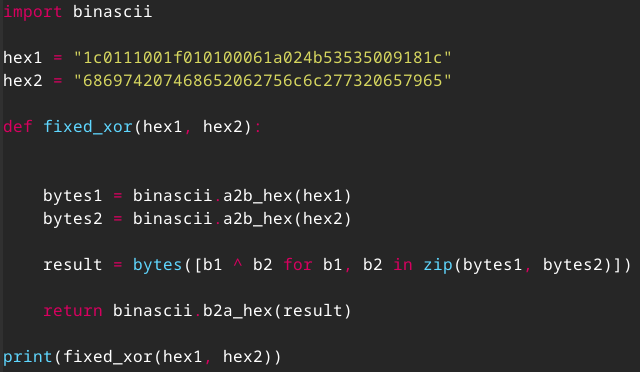
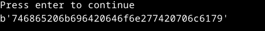
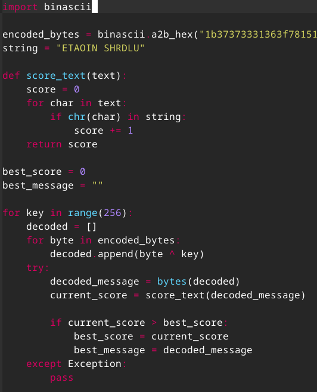
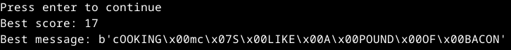
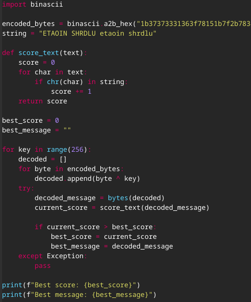
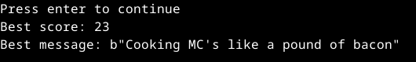

# Uhagre2

### Käyttöympäristö

Intel Core i7-1065G7, 3.40 GHz, 4 Core Processor  
RAM: 16 Gt  
Windows 11 Pro, versio 23H2  
Debian 12 Bookworm  

## Tiivistelmät
[**Schneier 2015: Applied Cryptography, 20ed: Chapter 1: Foundations:** ](https://www.oreilly.com/library/view/applied-cryptography-protocols/9781119096726/08_chap01.html#chap01-sec001)   
**1.1 Terminology**
- viestintä salataan, jotta estetään ulkopuolisten pääsy niiden sisältöön
- viestin (plaintext) salauksessa muodostetaan salakirjoitus (ciphertext), joka voidaan purkaa takaisin alkuperäiseksi
- kryptografia mahdollistaa viestin alkuperän todentamisen, muuttumattomuuden varmistamisen sekä lähetyksen kiistämättömyyden
- salauksen turvallisuus perustuu avaimiin eikä algoritmien salaamiseen, tämä mahdollistaen standardisoinnin ja analyysin
- symmetrisessä algoritmissä samaa avainta käytetään salaukseen sekä purkuun
- julkisen avaimen algoritmissä salaukseen ja purkuun käytetään eri avaimia
- kryptoanalyysi pyrkii purkamaan salakirjoituksen ilman avaimen tuntemista hyödyntäen erilaisia hyökkäyksiä
- algoritmin turvallisuus riippuu murtamisen vaikeudesta suhteessa suojattavan tiedon arvoon sekä tietojen säilytysajasta

**1.4 Simple XOR**
- XOR on bittitasolla toteutettava operaatio, jossa `a XOR a = 0` ja `a XOR b XOR b = a`
- XOR on symmetrinen algoritmi, joka käyttää avainsanaa salaamaan ja purkamaan tekstin yksinkertaisella XOR-operaatiolla
- salaus ja purku toimivat samalla ohjelmalla, koska kahden peräkkäisen XOR-operaation vaikutus kumoaa toisensa
- algoritmi on kuitenkin helppo murtaa myös ilman tietokonetta - tietokoneella purkaminen kestää vain sekunteja
- avaimen pituus voidaan selvittää `index of coincidence` -menetelmällä sekä kryptattua tekstiä voi analysoida sen toistuvuuksien avulla
- algoritmia käytetään edelleen yleisesti, vaikka se tarjoaakin vain heikon suojan

**1.7 Large Numbers**
- suuret luvut kryptografiassa selitetään fyysisillä analogeilla
- esim. atomien määrä planeetalla 10⁵¹, aika seuraavaan jääkauteen 14 000v

[**Python Basics for Hackers**](https://terokarvinen.com/python-for-hackers/)
- numeroiden ja kirjainten muunnokset tehdään `ord()` ja `chr()` funktioilla
- hexadesimaaliin, binääriin sekä oktaalinumeroiksi muuttaminen tehdään funktioilla `hex()`, `bin()` ja `oct()`
- **Obfuskaatio**: `"".join([chr(ord(c)+2) for c in "RcpmI"]) -> "TeroK"` - tässän muunnetaan kirjain ensiksi Unicode-arvoksi, jonka jälkeen siihen lisätään 2 ja vaihdetaan takas kirjaimeksi
- debuggaksessa `breakpoint()` on tärkeässä asemassa

## Tehtäviä

### Convert hex to base64
Lähdin tutkimaan tehtävää hieman hämmentyneellä mielellä. Päädyin mietiskelyjen jälkeen kurkkaamaan Teron laatimat [vinkit](https://terokarvinen.com/getting-started-python-cryptopals/) tälle tehtävälle.  
Osasinkin jon päätellä, että tähän tulee importata `base64`, jotta stringi saadaan lopulta siihen muunnettua. Lähdin tutkimaan netistä, mitä `binascii.a2b_hex` tekee ja miten sitä käytetään. Eteeni tuli Stack overflown [keskustelu](https://stackoverflow.com/questions/16808331/why-does-binascii-a2b-hex-return-a-string), josta sain vinkin miten tätä tulee käyttää. Sillä siis muunnetaan hex-merkkijono tavuiksi. Tämän jälkeen importtasin vielä `binascii`, jotta tämä muunnin toimii.  

Lisäsin tehtävänannosta saadun stringin `binascii.a2b_hex` -funktion sisään ja seuraavaksi muunsin tämän tavukasan `base64`-muotoon.  

### Fixed XOR
Tutkin tehtävänantoa ja se vaikutti hieman (paljon) haastavemmalta kuin aikaisempi.  
Kävin kurkkaamassa vinkkejä, jonka jälkeen tutkin netistä erilaisia tapoja ratkoa näitä.  
Päädyin Medium nimiselle [sivustolle](https://medium.com/analytics-vidhya/crypto-basics-fixed-xor-implementation-python-9cfba54f4661), jossa oli hyvin selitetty `XOR` käyttöä.  
Otin sieltä vinkkiä `zip()` funktion käytöstä ja hyödynsin sitä omassa ratkaisussa.  
Lyhyesti `zip()` funktio yhdistää iteroivia objekteja tupleiksi.  

Tallensin ensiksi `hex` merkkijonot omiin muuttujiin, jonka jälkeen funktio `fixed_xor` muuntaa merkkijonot tavuiksi. Seuraavaksi`b1 ^ b2` tekee XOR operaation tallennetuille tavuille.  
Lopulta XOR operaation tulos muunnetaan takaisin `hex` merkkijonoksi.  

### Single-byte XOR cipher
Lähdin tutustumaan tehävänantoon ja yllätys, että "Achievement Unlocked" laatikko herätti huomiota. Lähdin etsimään netistä vastausta, mitä "ETAOIN SHRDLU" oikein tarkoittaa. Cooke, J [artikkelista](https://www.johndcook.com/blog/2016/09/02/etaoin-shrdlu-and-all-that/) sain selville, että se on merkkijono, mikä koostuu englanninkielen yleisemmistä kirjaimista. 
Tehtävässä halutaan saada selville piilotettu viesti sekä laskea sen pisteet pisteytysmenetelmää käyttäen.  

Lähdin ensiksi kasaamaan pisteytykselle oman funktion `score_text()`. Pisteitä tässä kertyy, jos tekstissä oleva merkki täsmää annettuun "ETAOIN SHRDLU" merkkijonoon.  
Seuraavaksi `for key in range(256):` XOR-salausta yritetään purka testaamalla kaikkia 256 mahdollista avainta. `for byte in encoded_bytes` käy läpi kaikki tavut `encoded_bytes` merkkijonosta ja `decoded.append(byte ^ key)` suorittaa XOR-operaation ja tallenta ne `decoded = []` listaan.  
`try` lohkossa `decoded` listaan tallennetut merkit yritetään muuttaa tavuiksi ja laskea pisteet.  

Suotituksen jälkeen en vissiinkään saanut haluttua tulostusta.  
Pienen tauon jälkeen päädyin kurkkimaan Teron laatimista vinkeistä major spoilersseja. Siellä merkkijono "ETAOIN SHRDLU" oltiin merkitty sekä isoilla että pienillä kirjaimilla. Päätin koittaa vaihtaa samanlaisen merkkijonon.  
Sehän toimi?  

### Detect single-character XOR

## Lähteet
Karvinen, T. 2024. Tehtävänanto. https://terokarvinen.com/application-hacking/#h7-uhagre2.  
Karvinen, T. 2.12.2024. Python Basics for Hackers. Luettavissa: https://terokarvinen.com/python-for-hackers/. Luettu: 4.12.2024.  
Schneier, B. 2015. Applied Cryptography: Protocols, Algorithms and Source Code in C, 20th Anniversary Edition. Wiley. New York.  
CryptoPals. the cryptopals crypto challenges. Crypto Challenge Set 1. Luettavissa: https://cryptopals.com/sets/1. Luettu: 5.12.2024.  
Karvinen, T. 2.12.2024. Getting Started with Cryptopals using Python. Luettavissa: https://terokarvinen.com/getting-started-python-cryptopals/. Luettu: 5.12.2024  
Stack overflow. Why does binascii.a2b_hex() return a string? Luettavissa: https://stackoverflow.com/questions/16808331/why-does-binascii-a2b-hex-return-a-string. Luettu: 5.12.2024.   
Kültekin, Ö. 2021. Medium. Crypto Basics: Fixed XOR implementation [Python][Cryptopals]. Luettavissa: https://medium.com/analytics-vidhya/crypto-basics-fixed-xor-implementation-python-9cfba54f4661. Luettu: 5.12.2024.  
Cooke, J. 2.9.2016. John D. Cook Consulting. ETAOIN SHRDLU and all that. Luettavissa: https://www.johndcook.com/blog/2016/09/02/etaoin-shrdlu-and-all-that/. Luettu: 6.12.2024.  

